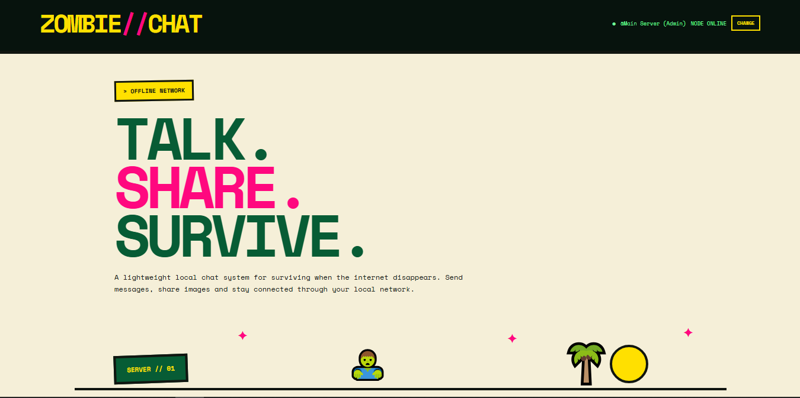
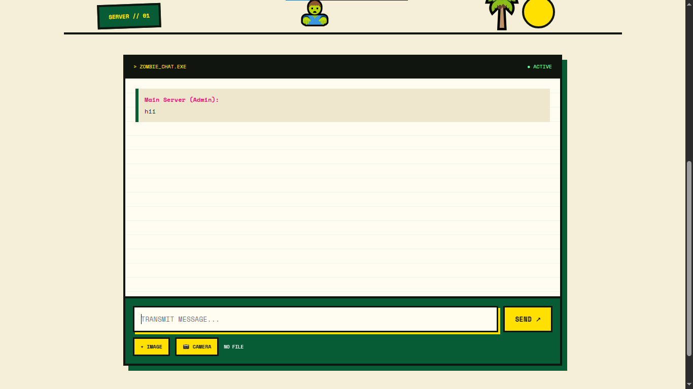

# 🧟 ZOMBIE // CHAT

> TALK. SHARE. SURVIVE.

A lightweight local-network chat system built with **Python and Flask**.

Zombie Chat allows people connected to the same local network to communicate,
send messages, and share images.

No account. No database. No internet required.

---

## ✨ Features

- 💬 Local-network messaging
- 🧟 Persistent user handles
- 🖼️ Image sharing
- 📱 Mobile-friendly interface
- 🔄 Automatic message refresh
- ⚡ Lightweight Flask backend
- 🎨 Retro hacker-style interface
- 💾 LocalStorage-based handle memory
- 🌐 Works on a local network
- 👥 Multiple devices can connect to the same server

> 📷 Camera capture was intentionally removed to keep the project simple and
> avoid browser HTTPS/camera permission issues.

---

## 📸 Screenshots

### 🧟 Main Interface



### 💬 Chat Interface



---

# 🚀 Installation

## 📋 Requirements

You need:

- Python 3.x
- Git
- A modern web browser
- Wi-Fi/local network for multiple devices

---

## 1. Clone the Repository

```bash
git clone https://github.com/programmeraj2011/zombie_chat.git
cd zombie_chat
python chat.py
2. Enter the Project
cd zombie_chat
3. Create a Virtual Environment
Windows
python -m venv venv

Activate it:

venv\Scripts\activate
Linux / macOS
python3 -m venv venv

Activate it:

source venv/bin/activate
4. Install Dependencies
pip install -r requirements.txt

The project uses:

Flask
Werkzeug
▶️ Running Zombie Chat

Start the server:

python chat.py

You should see:

==================================================
       🧟 ZOMBIE // CHAT
==================================================

Local:
http://127.0.0.1:5000

For other devices:
http://YOUR-PC-IP:5000

Camera: DISABLED
Image upload: ENABLED

==================================================
🌐 Open on Your Computer

Open:

http://127.0.0.1:5000

You can also use:

http://localhost:5000
📡 Use Zombie Chat on Multiple Devices

Zombie Chat can work across devices connected to the same local network.

Step 1 — Start the Server

On your computer:

python chat.py
Step 2 — Find Your Local IP

On Windows:

ipconfig

Look for:

IPv4 Address

Example:

192.168.1.5
Step 3 — Connect Your Phone

Connect your phone to the same Wi-Fi network.

Open:

http://192.168.1.5:5000

Replace 192.168.1.5 with the IP address of your computer.

🧟 Persistent Handles

The first time you open Zombie Chat, you enter your handle.

Example:

programmer_aj

Your handle is saved using browser LocalStorage.

When you open the website again, you don't need to enter it again.

You can change it using the CHANGE button.

Your handle may be reset if browser site data or LocalStorage is cleared.

🖼️ Image Sharing

Zombie Chat supports image uploads directly from the chat interface.

Click:

+ IMAGE

Choose an image and send it with your message.

Uploaded images are stored in:

uploads/

Uploaded files are excluded from Git using .gitignore.

💬 Messaging

Messages are handled by the Flask backend.

The frontend automatically checks for new messages every few seconds.

The current chat history is stored in server memory.

Therefore:

Restarting the Flask server clears the current chat history.

🛠️ Tech Stack
Backend
🐍 Python
🌶️ Flask
Werkzeug
Frontend
HTML
CSS
JavaScript
Browser APIs
💾 LocalStorage
🌐 Fetch API
📁 Project Structure
zombie_chat/
│
├── chat.py
├── requirements.txt
├── README.md
├── .gitignore
├── LICENSE
│
├── uploads/
│   └── .gitkeep
│
└── screenshots/
    ├── home.png
    └── chat.png
📦 requirements.txt
Flask
Werkzeug

Install them with:

pip install -r requirements.txt
🔧 Troubleshooting
Flask is not installed

Run:

pip install -r requirements.txt
python is not recognized

Try:

python3 chat.py

If that doesn't work, install Python and add it to your PATH.

Other devices cannot connect

Check that:

Both devices are connected to the same Wi-Fi
Zombie Chat is running
You are using the correct local IP
Port 5000 is allowed through Windows Firewall

Example:

http://192.168.1.5:5000
Images are not uploading

Make sure the uploads/ directory exists:

uploads/

The project automatically creates it when the server starts.

🔒 Privacy & Security

Zombie Chat is designed for local-network experimentation.

It does not currently provide:

User authentication
End-to-end encryption
Database storage
Production-grade security

Do not expose the Flask development server directly to the public internet
without adding appropriate security controls.

⚠️ Disclaimer

Zombie Chat is an experimental project created for learning,
experimentation, and local-network communication.

It uses Flask's development server and is not intended to be a
production-ready chat service.

🤝 Contributing

Contributions and ideas are welcome.

You can:

Fork the repository
Create a branch
Make your changes
Commit your changes
Open a pull request

Example:

git checkout -b feature/new-feature
git add .
git commit -m "Add new feature"
git push origin feature/new-feature
👨‍💻 Creator
Aditya Jaiswal

Built with:

Python + Flask + JavaScript + ☕ + 🧟
📜 License

This project is licensed under the MIT License.

See the LICENSE file for the complete license text.